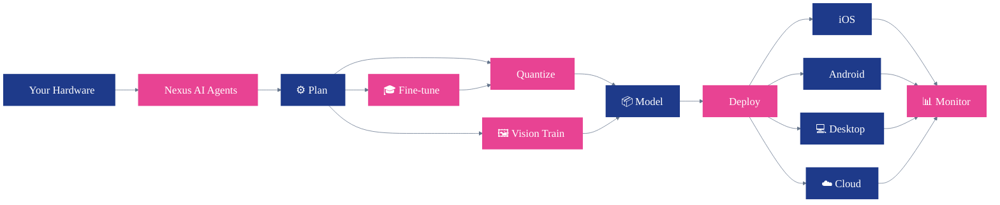

# QpiAI Nexus

**Democratize AI — one workflow to quantize, fine-tune, and deploy from cloud GPUs to phones.**

[](LICENSE)
[](https://huggingface.co/qpiai)
[](https://www.python.org/)
[](https://www.docker.com/)

<a href="https://github.com/user-attachments/assets/5764c7d7-16fb-47d2-9a73-6bb041757f4e">
  
</a>

▶ **[Watch with audio](https://github.com/user-attachments/assets/5764c7d7-16fb-47d2-9a73-6bb041757f4e)** (1 min · 720p)

---

## 🎯 Mission

> **Democratize AI by empowering every device.**
> Any model, any hardware — from a cloud GPU to the phone in your pocket — deployed with one workflow, no cloud lock-in.

Every section below is a way Nexus delivers that mission.

---

## Why Nexus

If you've used Ollama for inference or Unsloth for training, Nexus is the glue plus an **agent that decides what to run where**. Point it at your hardware; it picks the right model, the right quantization, and the right runtime — then deploys to whichever device is in front of you.

- 🤖 **Hardware-aware agent** — pick a model, describe your target device, get a recommended backend + bit-width
- 🔧 **6 quantization paths** — GGUF, AWQ, GPTQ, BitNet, MLX, or FP16 — each in its own isolated Python venv
- 🎓 **Fine-tune in the browser** — LoRA, QLoRA, or Full; SFT or GRPO; your dataset or synthetic
- 📱 **Deploy everywhere** — iOS / macOS (MLX), Android (llama.cpp JNI + TFLite), Desktop (Electron), Flutter

---

## 🚀 Quick Start

```bash
git clone https://github.com/qpiai/nexus.git && cd nexus
cp .env.example .env             # add at least LLM_API_KEY
docker compose up -d             # default: GGUF venv, ~1 GB, 2-3 min first run
open http://localhost:7777
```

**Default login:** `admin` / `qpiai-nexus` (change on first login → Profile → Change Password).

<details>
<summary>Other setup options</summary>

```bash
SETUP_VENVS=gguf,awq docker compose up -d    # GGUF + AWQ
SETUP_VENVS=all docker compose up -d         # everything (~3 GB)
SETUP_VENVS= docker compose up -d            # web UI only, instant start
docker compose logs -f                       # tail logs
docker compose down -v                       # reset (wipes models, venvs, users)
```

**Local dev (no Docker):**
```bash
cd llm-integration-platform && npm install
cp .env.example .env.local
bash scripts/setup_venvs.sh gguf             # or: setup_venvs.sh (all)
PORT=7777 npm run dev
```
</details>

---

## 🔧 Quantization

Pick a model, pick a target device — Nexus handles the rest. Each backend runs in its own Python venv so incompatible `transformers` / `autoawq` / `auto-gptq` versions never collide.

| Backend | Bit-widths | Hardware | Best for |
|---|---|---|---|
| **GGUF** | 2 · 3 · 4 · 5 · 8 · 16 | CPU or GPU | Cross-platform — llama.cpp runs everywhere |
| **AWQ** | 4 · 8 | NVIDIA GPU (CUDA required) | Server-side throughput |
| **GPTQ** | 2 · 3 · 4 · 8 | GPU preferred | Accuracy-sensitive post-training quantization |
| **BitNet** | 1 | CPU | Ultra-light edge / research |
| **MLX** | 2 · 3 · 4 · 5 · 6 · 8 | Apple Silicon | macOS / iOS on-device |
| **FP16** | 16 | GPU | Unquantized baseline |

**Model catalog** — 35 supported models out of the box: LLaMA 3.1/3.2/3.3, Qwen 2.5/3/3.5, Mistral, Phi-3/4, Gemma 2/3/3n, DeepSeek-R1, SmolLM 2/3, LFM, plus 4 VLMs (Qwen 2.5 VL, SmolVLM, Gemma 3 Vision). Any HuggingFace repo ID works too.

**How the flow runs:** describe your device → the 4-agent pipeline (research → reasoning → critic → orchestrator) recommends backend + bit-width → you click Run → SSE-streamed progress → quantized model lands in your downloads.

---

## 🎓 Fine-tuning

Unsloth under the hood. Run it in the browser, watch the loss curve, download the adapter — or merge and re-quantize for deployment.

| Method | What it is | Use when |
|---|---|---|
| **QLoRA** | 4-bit quantized LoRA — lowest VRAM | Consumer GPUs (recommended default) |
| **LoRA** | Low-rank adapter | You've got more VRAM and want faster training |
| **Full** | Full-parameter training | Adapters aren't enough — best quality, most VRAM |

**Training modes** — **SFT** (supervised instruction/response) and **GRPO** (reward-model RL with length / correctness / format rewards).

**Datasets** — 5 curated HF datasets one-click (Alpaca Cleaned, Dolly 15k, OpenAssistant, OpenHermes 2.5, Dolphin), or upload your own `.json` / `.jsonl`, or **generate synthetic data from seed examples** inside the app.

**Vision fine-tuning** — train YOLO26 / YOLO11 (detect or segment) on your images. Auto-detects COCO / YOLO / VOC dataset formats. Export in one click to **ONNX, TensorRT, CoreML, TFLite, OpenVINO, or NCNN** — everything you need for mobile and edge.

---

## 🏗️ Architecture

<div align="center">



</div>

---

## 🚀 Deploy anywhere

Every device gets a first-class client. All talk to the web platform over REST + SSE and can also run inference locally with no server connection.

| Platform | Stack | On-device inference | Build |
|---|---|---|---|
| **Web / Backend** | Next.js 14 · Python · llama.cpp | — | `cd llm-integration-platform && npm run dev` |
| **iOS / macOS** — `nexus-ios/` | Swift 6 · [mlx-swift-lm](https://github.com/ml-explore/mlx-swift-lm) | MLX on Apple Silicon | `open nexus-ios/Package.swift` in Xcode |
| **Android** — `nexus-android-v7/` | Kotlin · llama.cpp JNI · TFLite | LLMs + YOLO vision | `./gradlew assembleDebug` |
| **Desktop** — `nexus-desktop-v2/` | Electron · node-llama-cpp | CPU / GPU | `cd nexus-desktop-v2 && npm start` |
| **Flutter** — `nexus_mobile/` | Flutter · Riverpod · Hive | Remote (REST) | `flutter pub get && flutter build apk` |

---

## ⚙️ Configuration

<details>
<summary><b>LLM provider — pick any (Gemini, OpenAI, Anthropic, or any OpenAI-compatible endpoint)</b></summary>

Four env vars in `.env` switch providers — no code changes. The agent pipeline is built on the [Vercel AI SDK](https://sdk.vercel.ai/).

```bash
LLM_PROVIDER=google                          # google | openai | anthropic | openai-compatible
LLM_MODEL=gemini-3.1-flash-lite-preview      # any model the provider accepts
LLM_API_KEY=...                              # required
LLM_API_BASE=                                # only for openai-compatible
```

| Provider | `LLM_PROVIDER` | Example model |
|---|---|---|
| Google Gemini | `google` | `gemini-3.1-flash-lite-preview`, `gemini-flash-latest` |
| OpenAI | `openai` | `gpt-4o-mini`, `gpt-4o`, `o1-mini` |
| Anthropic Claude | `anthropic` | `claude-sonnet-4-5`, `claude-haiku-4-5` |
| Anything OpenAI-compatible | `openai-compatible` + `LLM_API_BASE` | LiteLLM, OpenRouter, Ollama, vLLM, TGI, LocalAI |

</details>

<details>
<summary><b>Other env vars</b></summary>

| Key | Purpose | Required? |
|---|---|---|
| `TAVILY_API_KEY` | Web search for agent research ([tavily.com](https://tavily.com/)) | Optional |
| `HF_TOKEN` | Gated HF models ([token page](https://huggingface.co/settings/tokens)) | Optional |
| `GOOGLE_CLIENT_ID` / `_SECRET` | Google OAuth login | Optional |
| `SETUP_VENVS` | Which Python venvs to install (`gguf` / `gguf,awq` / `all` / empty) | Optional |
| `PORT` | Web server port (default `7777`) | Optional |

Only `LLM_API_KEY` is required. Everything else is opt-in.

</details>

---

## 🗺️ Roadmap

Where the mission takes us next:

1. 📱 **Every device** — full iOS, Windows, and desktop Linux clients
2. ⚡ **Smarter runtimes** — faster on-device inference with hardware-aware agents that pick the best model and quantization automatically, in the spirit of [Claude Code](https://www.anthropic.com/claude-code), but running on *your* hardware
3. 🌐 **Federated fleet** — one control plane across hundreds of user devices, with privacy-first fine-tuning that never leaves the device

Follow along in [Issues](https://github.com/qpiai/nexus/issues).

---

## 🙏 Thanks

Nexus stands on the shoulders of giants. Grateful to [llama.cpp](https://github.com/ggml-org/llama.cpp), [AutoAWQ](https://github.com/casper-hansen/AutoAWQ), [AutoGPTQ](https://github.com/AutoGPTQ/AutoGPTQ), [MLX](https://github.com/ml-explore/mlx), [BitNet](https://github.com/microsoft/BitNet), [Unsloth](https://github.com/unslothai/unsloth), [Hugging Face 🤗](https://huggingface.co/), [PyTorch](https://pytorch.org/), [Ultralytics](https://github.com/ultralytics/ultralytics), [Anthropic](https://www.anthropic.com/), [Google Gemini](https://ai.google.dev/), and the open-source community that makes this possible — thank you.

---

## 🤝 Contributing · ⭐ Star · 📜 License

Fork, build, PR — see [CONTRIBUTING.md](CONTRIBUTING.md). Docs fixes count too.
If Nexus helps you, a ⭐ helps us reach more people who could benefit.
Check out our other projects at **[github.com/qpiai](https://github.com/qpiai)**.

Copyright 2026 QpiAI. Licensed under the [Apache License 2.0](LICENSE).
