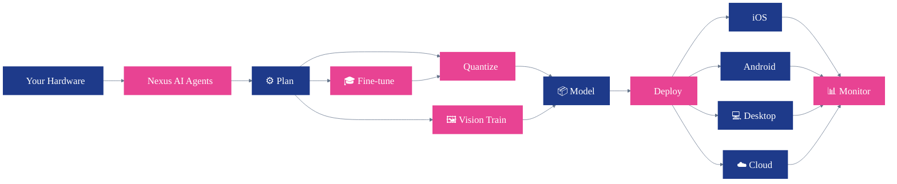

# QpiAI Nexus

**The open-source edge intelligence platform — from cloud GPUs to phones.**

[](LICENSE)
[](https://huggingface.co/qpiai)
[](https://www.python.org/)
[](https://www.docker.com/)

<a href="llm-integration-platform/public/NexusV7_small.mp4">
  
</a>

▶ **[Watch with audio](llm-integration-platform/public/NexusV7_small.mp4)** (1 min · 720p)

---

## 🎯 Our Mission

> Nexus exists to **democratize AI** and **empower every device**. Any model, any hardware — from cloud GPUs to the phone in your pocket — deployed with one workflow, no cloud lock-in required.

---

## ✨ What you can do with Nexus

- 🤖 Let an AI agent pick the right model + quantization for your hardware
- 🔧 Quantize with **GGUF, AWQ, GPTQ, BitNet, MLX**, or keep **FP16**
- 🎓 Fine-tune with **LoRA** or **QLoRA** directly in your browser
- 🖼️ Train **YOLO** vision models and export to ONNX, TensorRT, CoreML, TFLite, OpenVINO, NCNN
- 📱 Deploy the same workflow to **iOS, Android, desktop, edge, or cloud**
- 📊 Watch **CPU, GPU, memory, power, and throughput** live across every device

---

## 🚀 Quick Start (Docker)

```bash
# 1. Clone
git clone https://github.com/qpiai/nexus.git && cd nexus

# 2. Add your API keys
cp .env.example .env    # add at least GEMINI_API_KEY

# 3. Start Nexus
docker compose up -d

# 4. Open in browser
open http://localhost:7777
```

On first startup the GGUF Python environment installs automatically (~1 GB, 2–3 minutes). Subsequent starts are instant — venvs persist in a Docker volume.

### First login

| | |
|---|---|
| **Username** | `admin` |
| **Password** | `qpiai-nexus` |

Please change the password on first login → click your avatar → **Profile** → **Change Password**.

### Choose which backends to install

```bash
docker compose up -d                              # GGUF only (default, ~1 GB)
SETUP_VENVS=gguf,awq docker compose up -d         # GGUF + AWQ
SETUP_VENVS=all docker compose up -d              # Everything (~3 GB)
SETUP_VENVS= docker compose up -d                 # Web UI only, instant start
```

### Everyday commands

```bash
docker compose up -d           # Start in background
docker compose logs -f         # Follow logs
docker compose down            # Stop
docker compose up -d --build   # Rebuild after code changes
docker compose down -v         # Reset (wipes models, venvs, user data)
```

---

## 🛠️ Local Development

```bash
cd llm-integration-platform
npm install
cp .env.example .env.local      # add API keys
PORT=7777 npm run dev           # start dev server

# Optional: set up Python venvs for quantization
bash scripts/setup_venvs.sh gguf    # just GGUF (~1 GB)
bash scripts/setup_venvs.sh         # all methods
```

Default login: `admin` / `qpiai-nexus`.

---

## 🔑 API Keys & LLM Provider

Configure in `.env` (Docker) or `llm-integration-platform/.env.local` (local dev).

### Pick any LLM provider — it's all env-driven

The agent pipeline is provider-agnostic (built on the [Vercel AI SDK](https://sdk.vercel.ai/)). Switch providers by changing four variables — no code changes needed.

```bash
LLM_PROVIDER=google                      # google | openai | anthropic | openai-compatible
LLM_MODEL=gemini-3.1-flash-lite-preview  # any model name the provider accepts
LLM_API_KEY=...                          # required
LLM_API_BASE=                            # only for openai-compatible (see below)
```

**Supported out of the box:**

| Provider | How | Example model |
|---|---|---|
| 🤖 **Google Gemini** | `LLM_PROVIDER=google` + [AI Studio key](https://aistudio.google.com/apikey) | `gemini-3.1-flash-lite-preview`, `gemini-flash-latest` |
| 🟢 **OpenAI** | `LLM_PROVIDER=openai` + [OpenAI key](https://platform.openai.com/api-keys) | `gpt-4o-mini`, `gpt-4o`, `o1-mini` |
| 🟣 **Anthropic Claude** | `LLM_PROVIDER=anthropic` + [Anthropic key](https://console.anthropic.com/) | `claude-sonnet-4-5`, `claude-haiku-4-5` |
| 🔌 **Anything OpenAI-compatible** | `LLM_PROVIDER=openai-compatible` + `LLM_API_BASE=…` | LiteLLM, OpenRouter, Ollama, vLLM, TGI, LocalAI |

**Examples for the escape-hatch route:**

```bash
# LiteLLM proxy
LLM_PROVIDER=openai-compatible
LLM_API_BASE=http://litellm:4000/v1
LLM_MODEL=gpt-4o-mini

# OpenRouter (500+ models behind one URL)
LLM_PROVIDER=openai-compatible
LLM_API_BASE=https://openrouter.ai/api/v1
LLM_MODEL=anthropic/claude-sonnet-4.5

# Local Ollama
LLM_PROVIDER=openai-compatible
LLM_API_BASE=http://localhost:11434/v1
LLM_MODEL=llama3.1
```

### Other keys

| Key | Provider | Purpose | Required? |
|---|---|---|---|
| `TAVILY_API_KEY` | [Tavily](https://tavily.com/) | Web search for agent research | Optional |
| `HF_TOKEN` | [HuggingFace](https://huggingface.co/settings/tokens) | Downloading gated models | Optional |
| `GOOGLE_CLIENT_ID` / `_SECRET` | [Google Cloud Console](https://console.cloud.google.com/apis/credentials) | Google OAuth login | Optional |

Only `LLM_API_KEY` (for your chosen provider) is required. Everything else is opt-in.

---

## 📁 Repository Structure

```
nexus/
├── llm-integration-platform/     # Web app & backend (Next.js 14 + Python)
├── nexus-android-v7/             # Android (Kotlin · agent + VLM + vision + QR login)
├── nexus-ios/                    # iOS / macOS (Swift 6 + MLX)
├── nexus-desktop-v2/             # Desktop (Electron + node-llama-cpp)
├── nexus_mobile/                 # Cross-platform mobile (Flutter)
├── Dockerfile                    # Docker build (multi-stage)
├── docker-compose.yml            # One-command deployment
├── docker-entrypoint.sh          # Auto venv setup on first run
├── LICENSE                       # Apache 2.0
└── CONTRIBUTING.md               # Contribution guidelines
```

---

## 🏗️ Architecture

<div align="center">



</div>

**How the flow reads:** tell Nexus your hardware → the AI agents build a plan → **fine-tune then quantize**, **quantize directly**, or **train a vision model** — all converge into one model → deploy to any device → live monitor across the fleet.

**On-device inference everywhere:**

- **iOS / macOS** — MLX (Apple Silicon GPUs)
- **Android** — TFLite (vision) + llama.cpp via NDK (LLMs)
- **Desktop** — node-llama-cpp (CPU / GPU)

All clients talk to the web platform over REST + SSE and can also run inference locally without a server connection.

---

## 🗺️ Roadmap

Where Nexus is headed next:

1. 📱 **Every device** — full iOS, Windows, and desktop Linux clients
2. ⚡ **Smarter runtimes** — faster on-device inference with hardware-aware agents that pick the best model and quantization automatically, in the spirit of **[Claude Code](https://www.anthropic.com/claude-code)**, **[OpenClaw](https://github.com/openclaw/openclaw)** — but running on *your* hardware
3. 🌐 **Federated fleet** — one control plane across hundreds of user devices, with privacy-first fine-tuning that never leaves the device

Follow along in [Issues](https://github.com/qpiai/nexus/issues) and [Discussions](https://github.com/qpiai/nexus/discussions).

---

## 📦 Components

### Web Platform — `llm-integration-platform/`

The core of Nexus: a Next.js 14 app with 15 pages, 47 API routes, and 19 Python scripts handling the ML side.

**Highlights:** 4-agent AI workflow on Gemini 2.0 Flash + Tavily · 100+ model catalog (LLaMA 3, Phi-4, Qwen, Mistral, DeepSeek-R1, Gemma 3…) · 6 quantization methods · LoRA/QLoRA fine-tuning · YOLO vision training with 6 export formats · real-time chat with quantized models · device management with QR pairing · live system telemetry · JWT auth + optional Google OAuth.

**Tech stack:** Next.js 14 · React 18 · TypeScript · Tailwind · Python · PyTorch · Transformers · llama.cpp

---

### 🐍 Python Environments

Different quantization methods need different package versions, so each runs in its own isolated venv.

| Venv | Size | Packages | Used by |
|---|---|---|---|
| `gguf` | ~1 GB | transformers<5, huggingface-hub, gguf, torch | GGUF quantization + inference |
| `awq` | ~1 GB | autoawq, transformers>=5, accelerate | AWQ quantization |
| `gptq` | ~1 GB | auto-gptq, transformers>=5, datasets | GPTQ quantization |

**Docker** installs them automatically via `SETUP_VENVS`. **Local dev:**

```bash
cd llm-integration-platform
bash scripts/setup_venvs.sh gguf       # pip-based, one method
bash scripts/setup_venvs.sh            # pip-based, all methods
bash scripts/setup_all_venvs.sh gguf   # uv-based (faster, needs uv)
```

---

### 🤖 Android — `nexus-android-v7/`

Kotlin app with an on-device agent, inference, and vision. ReAct-style agent with 9 tools (llama.cpp JNI) · VLM chat with image attachment · on-device TFLite object detection + segmentation (YOLO) · server-side vision fallback · confidence / IoU controls · QR code login, email/password auth, offline mode.

```bash
cd nexus-android-v7/app/src/main/cpp
git clone https://github.com/ggerganov/llama.cpp
cd ../../../../..
./gradlew assembleDebug
```

---

### 📱 iOS / macOS — `nexus-ios/`

A native Swift 6 client with two targets:

| Target | What it does |
|---|---|
| **NexusApp** | Device monitoring, vision inference, chat with server-side models |
| **NexusChat** | On-device LLM inference using MLX, with 4 pre-configured models |

```bash
open nexus-ios/NexusApp/NexusApp.xcodeproj
# Requires macOS + Apple Silicon for MLX
```

---

### 💻 Desktop — `nexus-desktop-v2/`

Electron desktop app with local inference via `node-llama-cpp`.

```bash
cd nexus-desktop-v2
npm install
npm start                     # dev
npm run build                 # build for all platforms
```

---

### 🎯 Flutter — `nexus_mobile/`

Cross-platform mobile client built with Flutter + Riverpod + Hive.

```bash
cd nexus_mobile
flutter pub get
flutter build apk             # Android
flutter build ios             # iOS
```

---

## 💻 Environment Requirements

| Component | Requirements |
|---|---|
| Docker deployment | Docker 20+, Docker Compose v2 |
| Local web platform | Node.js 18+, Python 3.10+, cmake |
| iOS | macOS, Xcode 15+, Apple Silicon (for MLX) |
| Android | Android Studio, SDK 35, NDK 27, CMake |
| Flutter | Flutter SDK 3.16+, Dart 3.2+ |
| Desktop | Node.js 18+ |

---

## 🧪 Testing

```bash
cd llm-integration-platform
npm test                      # all tests
npm run lint                  # ESLint
npm run build                 # production build
```

---

## 🤝 Contributing

We'd love your help. Fork the repo, build something, open a PR — see [CONTRIBUTING.md](CONTRIBUTING.md) for the details. Drive-by documentation fixes count too.

---

## ⭐ Star

If you find Nexus useful, please give it a star — it genuinely helps us reach more people who could benefit.

---

## 🌐 More from QpiAI

Check out our other open-source projects at **[github.com/qpiai](https://github.com/qpiai)**.

---

## 📜 License

Copyright 2026 QpiAI. Licensed under the [Apache License 2.0](LICENSE).
