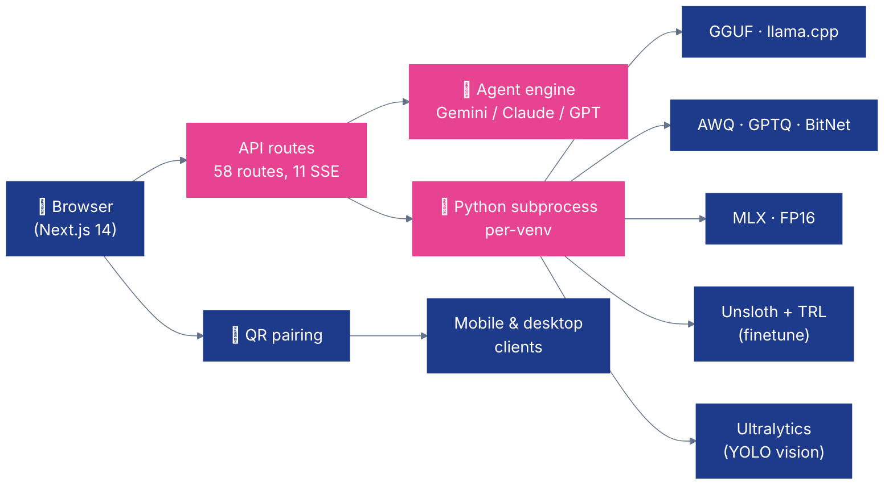

# 🌐 Nexus — Web Platform

**The Nexus web app and Python backend. Next.js 14 · 14 pages · 58 API routes · 19 ML scripts · 6 quantization backends.**

[](https://nextjs.org/)
[](https://www.typescriptlang.org/)
[](https://www.python.org/)
[](https://tailwindcss.com/)

---

## ✨ What it does

- 🤖 **Agent-driven pipeline** — 4 agents (research → reasoning → critic → orchestrator) pick the best model + backend + bit-width for your hardware
- 🔧 **Quantize in the browser** — GGUF, AWQ, GPTQ, BitNet, MLX, FP16 — each in an isolated Python venv, with live SSE progress
- 🎓 **Fine-tune in the browser** — LoRA / QLoRA / Full · SFT + GRPO · Unsloth under the hood · synthetic data generation
- 🖼️ **Train YOLO vision models** — upload → auto-detect COCO/YOLO/VOC → train → export to ONNX / TensorRT / CoreML / TFLite / OpenVINO / NCNN
- 📊 **Live telemetry** — CPU / GPU / memory / power metrics streaming from every connected device
- 📱 **QR device pairing** — scan once, register any phone or desktop client to the fleet

---

## 🚀 Quick Start

```bash
npm install
cp .env.example .env.local              # add at least LLM_API_KEY

# Install uv (recommended — fast Python package manager used for venv isolation)
curl -LsSf https://astral.sh/uv/install.sh | sh

# Set up the GGUF venv (~1 GB, CPU-capable — good default)
bash scripts/setup_all_venvs.sh gguf

PORT=7777 npm run dev                   # http://localhost:7777
```

> 💡 **uv is the recommended setup path.** It's what Docker uses and what we develop against. `scripts/setup_venvs.sh` exists as a pip-based fallback for environments where uv isn't available.

**Default login:** `admin` / `qpiai-nexus` (change on first login).

<details>
<summary>Other venv options</summary>

```bash
bash scripts/setup_all_venvs.sh                 # all methods (~3 GB)
bash scripts/setup_all_venvs.sh gguf finetune   # pick a subset
bash scripts/setup_venvs.sh                     # pip --target fallback (no uv)
```

Each backend gets its own `venvs/<method>/` with its own Python version. Scripts use `sys.path.insert(0, …)` to load the right one — no activation needed. Docker uses the same `setup_all_venvs.sh` path on first run, driven by the `SETUP_VENVS` env var.
</details>

---

## 🏗️ Architecture



Python scripts never share a venv with each other — different `transformers` versions (`<5` for GGUF vs `≥5` for AWQ/GPTQ) would otherwise collide.

---

## 📁 Code map

| Area | Path | Notes |
|---|---|---|
| **Pages (14)** | `src/app/*/page.tsx` | Home · Admin · Chat · Deploy · Devices · Downloads · Finetune · Login · Metrics · Monitor · Pipeline · Profile · Quantize · Vision |
| **API routes (58)** | `src/app/api/**/route.ts` | SSE streams use `ReadableStream` + `force-dynamic` |
| **Components** | `src/components/` | `ui/` primitives · `pipeline/` agent/quantize/finetune/vision panels · `monitor/` telemetry |
| **Core logic** | `src/lib/engines/` | `agent-system.ts` (4-agent workflow) · `tavily.ts` (web search) · LLM provider adapters |
| **Types & constants** | `src/lib/types.ts`, `src/lib/constants.ts` | Model catalog, quant presets, vision models, export formats |
| **State** | `src/lib/store.ts`, `src/lib/finetune-state.ts`, `src/lib/vision-train-state.ts` | In-memory; resets on restart |
| **Auth** | `src/lib/auth.ts`, `src/middleware.ts`, `src/lib/users.ts` | JWT (HMAC-SHA256) + optional Google OAuth |
| **Python scripts (19)** | `scripts/*.py` | See venv table below |
| **Tests** | `__tests__/` | Jest 30, 6 suites |

---

## 🐍 Python venvs (7 isolated environments)

| Venv | Python | Purpose | Key packages |
|---|---|---|---|
| `gguf` | 3.11 | GGUF quant + llama.cpp inference | `transformers<5`, `gguf>=0.6` |
| `awq` | 3.11 | AWQ quant + FP16/VLM inference | `autoawq`, `transformers>=4.45` |
| `gptq` | 3.11 | GPTQ quant | `auto-gptq`, `transformers>=4.45` |
| `bitnet` | 3.11 | 1-bit quant + inference | `bitnet-pytorch`, `transformers>=4.45` |
| `mlx` | 3.11 | MLX quant + inference (Apple Silicon) | `mlx>=0.15`, `mlx-lm` |
| `finetune` | 3.10 | LoRA / QLoRA / Full · SFT + GRPO | `unsloth`, `llamafactory`, `trl`, `peft`, `bitsandbytes` |
| `vision` | 3.10 | YOLO train / infer / export | `ultralytics>=8.3`, `onnxruntime-gpu`, `tensorrt` |

All venvs are created with [uv](https://docs.astral.sh/uv/) (`scripts/setup_all_venvs.sh`) — each one gets its own Python interpreter and its own dependency tree, resolved from `scripts/requirements/<method>.txt`. On environments without uv, `scripts/setup_venvs.sh` falls back to `pip install --target=…`.

---

## 🤖 Agent workflow

Defined in `src/lib/engines/agent-system.ts:7-12`. Runs 2 iterations for refinement.

| # | Agent | Role |
|---|---|---|
| 1 | **Research** | Tavily web search (iteration 1 only) + LLM analysis of model / hardware fit |
| 2 | **Reasoning** | Scores models against device RAM / VRAM budget with safety margin |
| 3 | **Critic** | Flags issues — unsupported architectures, risky bit-widths, missing tokenizers |
| 4 | **Orchestrator** | Synthesises a final recommendation (model + backend + bit-width + rationale) |

The LLM used is set by `LLM_PROVIDER` / `LLM_MODEL` / `LLM_API_KEY`. Gemini is the default; OpenAI, Anthropic, and any OpenAI-compatible endpoint (Ollama, LiteLLM, OpenRouter, vLLM) all work via the [Vercel AI SDK](https://sdk.vercel.ai/).

---

## ⚙️ Environment

Copy `.env.example` → `.env.local` and set:

| Var | Purpose | Required? |
|---|---|---|
| `LLM_PROVIDER` | `google` · `openai` · `anthropic` · `openai-compatible` | ✅ |
| `LLM_MODEL` | Model name (e.g. `gemini-3.1-flash-lite-preview`) | ✅ |
| `LLM_API_KEY` | Provider API key | ✅ |
| `LLM_API_BASE` | Only for `openai-compatible` | If used |
| `TAVILY_API_KEY` | Agent web search ([tavily.com](https://tavily.com)) | Optional |
| `HF_TOKEN` | Gated HF models | Optional |
| `GOOGLE_CLIENT_ID` / `_SECRET` | Google OAuth login | Optional |
| `PORT` | Web server port (default `7777`) | Optional |
| `NEXT_PUBLIC_RELEASES_BASE` | CDN for client app downloads | Optional |

---

## 🌐 API routes (58 — by area)

<details>
<summary>Expand full list</summary>

| Area | Routes |
|---|---|
| **Auth (7)** | `/login`, `/signup`, `/logout`, `/me`, `/change-password`, `/google`, `/callback/google` |
| **Agents (3)** | `/agents/run` (SSE), `/agents/status`, `/agent/chat` |
| **Chat (2)** | `/chat` (SSE), `/chat/models` |
| **Quantization (5)** | `/run` (SSE), `/status`, `/stop`, `/check`, `/download` |
| **Finetune (8)** | `/run` (SSE), `/models`, `/datasets`, `/upload-dataset`, `/status`, `/stop`, `/generate-synthetic`, `/save-synthetic`, `/hf-dataset` |
| **Vision (11)** | `/train` (SSE), `/train/runs`, `/train/stop`, `/export`, `/infer`, `/models`, `/upload-image`, `/dataset/{upload,prepare,list,sample}`, `/agents/run` (SSE), `/agents/status` |
| **Mobile (8)** | `/register`, `/models`, `/upload`, `/revoke`, `/qr`, `/ws` (SSE), `/vision/models`, `/vision/infer`, `/vision/download` |
| **Deploy (3)** | `/start`, `/status`, `/list` |
| **Telemetry (4)** | `/live` (SSE), `/history`, `/report`, `/alerts` |
| **Admin (2)** | `/users`, `/stats` |
| **Tasks (1)** | `/active` (in-progress jobs across all features) |

SSE routes all use the pattern `export const dynamic = 'force-dynamic'` + a `ReadableStream` that re-emits JSON lines from Python subprocesses.
</details>

---

## 🧰 Python scripts (19)

<details>
<summary>Expand full list (grouped by venv)</summary>

| Script | Venv | Purpose |
|---|---|---|
| `quantize_gguf.py` | gguf | Convert HF → GGUF via llama.cpp |
| `quantize_awq.py` | awq | AWQ 4 / 8-bit (CUDA required) |
| `quantize_gptq.py` | gptq | GPTQ 2 / 3 / 4 / 8-bit |
| `quantize_bitnet.py` | bitnet | 1-bit binary quantization |
| `quantize_mlx.py` | mlx | Apple Silicon quantization |
| `infer_gguf.py` | gguf | llama.cpp binary inference |
| `infer_awq.py` | awq | AWQ inference |
| `infer_gptq.py` | gptq | GPTQ inference |
| `infer_bitnet.py` | bitnet | BitNet inference |
| `infer_mlx.py` | mlx | MLX inference |
| `infer_fp16.py` | awq | FP16 baseline inference |
| `infer_vlm.py` | awq | Vision-language model inference |
| `infer_finetune.py` | finetune | Fine-tuned LoRA inference |
| `finetune_unsloth.py` | finetune | LoRA / QLoRA / Full · SFT + GRPO |
| `vision_train.py` | vision | YOLO detect / segment training |
| `vision_infer.py` | vision | YOLO inference on images |
| `vision_export.py` | vision | Export → ONNX / TRT / CoreML / TFLite / OpenVINO / NCNN |
| `vision_dataset_prepare.py` | vision | Auto-convert COCO / VOC → YOLO |
| `download_model.py` | gguf | HF download with resume |

</details>

---

## 🧪 Testing

```bash
npm test                                    # all Jest suites
npx jest __tests__/utils.test.ts            # single file
npx jest --testNamePattern="formatBytes"    # filter by name
npm run lint                                # ESLint
npm run build                               # prod build
```

`tsconfig.json` and `jest.config.ts` must exclude `output/`, `venvs/`, and `scripts/` — cmake generates stray `.ts` files in `output/` that would break compilation.

---

## 🔁 Communication pattern

Every long-running operation (agents, quantization, chat inference, fine-tuning, vision training, telemetry) uses **Server-Sent Events**. API routes spawn Python subprocesses, parse JSON lines from stdout, and re-emit as SSE. This keeps the UI responsive with live progress bars, log tails, and token streams.

---

Part of [QpiAI Nexus](../README.md). Licensed under [Apache 2.0](../LICENSE).
