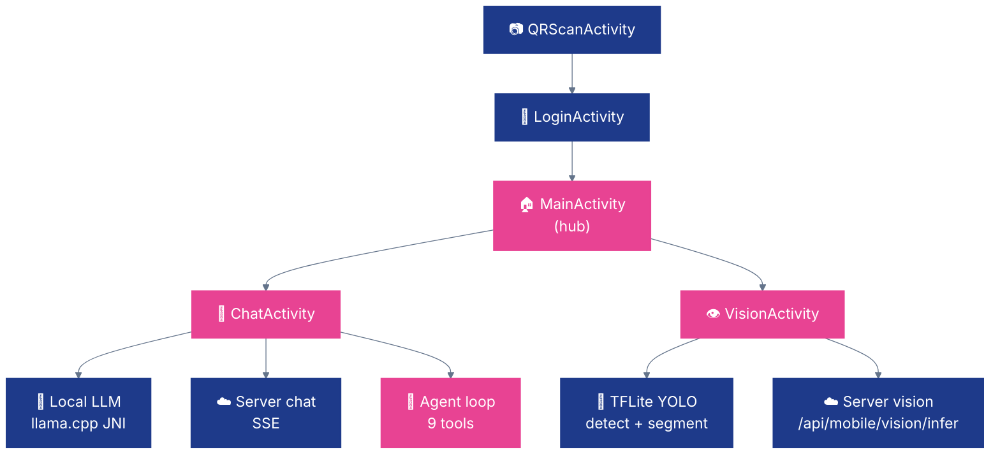

# 🤖 Nexus — Android

**Nexus for Android — Kotlin · on-device agent · VLM chat · TFLite vision · llama.cpp via JNI.**

[](https://kotlinlang.org/)
[](https://developer.android.com/)
[](https://developer.android.com/ndk)
[]()

---

## ✨ What it does

- 🤖 **On-device agent** — ReAct-style loop over llama.cpp with **9 tools** (calculator · datetime · device info · file read/write · notifications · vision detect · web fetch · web search)
- 💬 **Chat with LLMs & VLMs** — send text, attach images from gallery or camera, stream tokens locally (llama.cpp JNI) or from the server
- 👁️ **On-device vision** — TFLite YOLO detection + segmentation with live camera preview, adjustable confidence / IoU sliders
- 📷 **QR device pairing** — scan the QR from the web UI and auto-register against the server
- 🌐 **Server mode** — every screen can fall back to REST/SSE against the Nexus web platform when a model isn't downloaded locally

---

## 🚀 Quick Start

```bash
# 1. Clone llama.cpp into the JNI source dir
cd app/src/main/cpp
git clone https://github.com/ggerganov/llama.cpp.git
cd ../../../../..

# 2. Build the debug APK
./gradlew assembleDebug

# 3. Install on a connected device
adb install app/build/outputs/apk/debug/app-debug.apk
```

**Requires:** Android Studio · Android SDK 35 · NDK 27.2.12479018 · CMake 3.22.1 · JDK 17. Device must be arm64-v8a (all modern phones).

On first launch, scan the QR code from the Nexus web UI (`/devices`) — or enter the server URL and admin credentials manually.

---

## 🏗️ Architecture



---

## 📁 Code map

| Area | Path | Notes |
|---|---|---|
| **Activities** | `app/src/main/java/com/nexus/v7/*Activity.kt` | Login · Main · Chat · QRScan · Vision |
| **Agent** | `.../agent/AgentLoop.kt` + `.../agent/tools/*Tool.kt` | Max 5 steps, 9 tools |
| **Local LLM (JNI)** | `app/src/main/cpp/nexus_jni.cpp`, `LlamaEngine.kt` | Singleton; init → loadModel → prepare → generate |
| **Local vision** | `.../vision/TFLiteDetector.kt` | YOLO dual-output, 640px input, NMS |
| **API client** | `.../api/NexusApiClient.kt` | OkHttp + SSE, JWT bearer header |
| **Model downloads** | `.../ModelDownloadManager.kt` | Runtime download to internal storage (no bundled models) |
| **CMake** | `app/src/main/cpp/CMakeLists.txt` | Expects `llama.cpp/` subfolder |

---

## 🔧 Stack

| Library | Version | Role |
|---|---|---|
| [OkHttp](https://square.github.io/okhttp/) | 4.12.0 | HTTP + SSE |
| [TensorFlow Lite](https://www.tensorflow.org/lite) | 2.16.1 | On-device vision (+ GPU delegate) |
| [CameraX](https://developer.android.com/training/camerax) | 1.3.4 | Camera preview & capture |
| [ML Kit Barcode](https://developers.google.com/ml-kit/vision/barcode-scanning) | 17.3.0 | QR scanning |
| [Kotlinx Coroutines](https://github.com/Kotlin/kotlinx.coroutines) | 1.8.1 | Async flows |
| [llama.cpp](https://github.com/ggml-org/llama.cpp) | HEAD (cloned) | JNI LLM inference |

---

## 🌐 Server API

All requests carry `Authorization: Bearer <jwt>` once logged in.

| Endpoint | Purpose |
|---|---|
| `POST /api/auth/login` | Email/password → JWT |
| `POST /api/mobile/register` | Register this device, get device ID |
| `GET  /api/chat/models` | List server-hosted LLMs |
| `POST /api/chat` (SSE) | Server-side chat, token stream |
| `GET  /api/mobile/vision/models` | List server vision models |
| `POST /api/mobile/vision/infer` | Server-side YOLO inference |

---

## 🔐 Permissions

From `AndroidManifest.xml`:

- `INTERNET`, `ACCESS_NETWORK_STATE` — always required
- `POST_NOTIFICATIONS`, `WAKE_LOCK` — long-running inference
- `CAMERA` — optional (`android:required="false"`); needed for vision + QR scan

---

## 🧪 Troubleshooting

- **`llama.cpp` not found during CMake** — re-run step 1 of Quick Start; the `cpp/llama.cpp/` directory must exist before `./gradlew`.
- **NDK version mismatch** — install `27.2.12479018` via Android Studio → SDK Manager → SDK Tools → NDK (side-by-side).
- **Model downloads stuck** — check `server_url` in app settings; confirm the web platform is reachable from the phone's network.
- **TFLite GPU delegate fails on emulator** — expected; emulators usually lack Vulkan. Test on a real device.

---

Part of [QpiAI Nexus](../README.md). Licensed under [Apache 2.0](../LICENSE).
