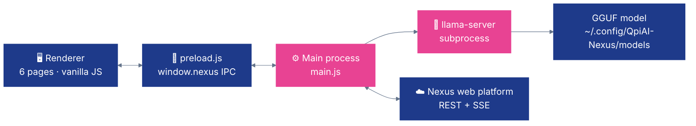

# 💻 Nexus — Desktop

**Nexus for Desktop — Electron app with local llama-server inference. Windows · Linux · macOS.**

[](https://www.electronjs.org/)
[](https://nodejs.org/)
[]()

---

## ✨ What it does

- 🧠 **Local LLM inference** — spawns a bundled `llama-server` subprocess, streams tokens via OpenAI-compatible `/v1/chat/completions` SSE
- 📦 **Model management** — browse server models, download GGUF files locally (resumable), switch with one click
- 💬 **Chat + Vision** — chat with any downloaded model; send images to the server for VLM / YOLO analysis
- 📊 **Live metrics** — push CPU / RAM / active-model / token-count to the Nexus server every 15 s, watch logs in-app
- 🖥️ **Cross-platform** — native installers for Windows (NSIS + portable), Linux (AppImage + .deb), macOS (zip, x64 + arm64 universal)

---

## 🚀 Quick Start

```bash
npm install
npm start                 # launch the dev app
```

**Requires:** Node.js 18+. That's it — `llama-server` binaries for all three OSes ship inside `bin/`.

On first launch, point it at your Nexus web server (e.g. `http://localhost:7777`) and log in (`admin` / `qpiai-nexus` by default). Downloaded models live in `~/.config/QpiAI-Nexus/models/`.

---

## 📦 Build installers

```bash
npm run build             # Windows + Linux (CI default)
npm run build-win         # Windows only (NSIS + portable)
npm run build-linux       # Linux only (AppImage + .deb)
npm run build-mac         # macOS only (zip, x64 + arm64)
npm run pack              # unpacked directory (no installer)
```

Artifacts are written to `dist/`.

---

## 🏗️ Architecture



The renderer is plain HTML + vanilla JS (no React / Vue). State is in-memory globals. The preload bridge (`contextBridge`) exposes IPC as `window.nexus.*` for safe renderer calls.

---

## 📁 Code map

| Area | Path | Notes |
|---|---|---|
| **Main process** | `src/main.js` | BrowserWindow · IPC handlers · llama-server lifecycle · tray / menu |
| **Preload bridge** | `src/preload.js` | Exposes `window.nexus` API to renderer |
| **Renderer HTML** | `src/index.html` | Single page with `.page` divs + sidebar nav |
| **Renderer JS** | `src/renderer.js` | Page controllers, event wiring, fetch calls |
| **Binaries** | `bin/{win-x64,linux-x64,darwin-x64,darwin-arm64}/` | `llama-server` + ggml / llama shared libs |
| **Build config** | `package.json` (`build` field) | electron-builder targets |

---

## 🖥️ UI pages (6)

Rendered as `.page` divs inside one BrowserWindow (1000×750, min 800×600):

| Page | Purpose |
|---|---|
| **Connect** | Server URL + login |
| **Models** | Browse server-hosted GGUF models, download locally |
| **Chat** | Local or server chat, token streaming |
| **Vision** | Upload images to server for VLM / YOLO inference |
| **Logs** | Tail `llama-server` stdout and app logs |
| **Metrics** | Live CPU / RAM / active-model / tokens-per-sec |

---

## 🔌 IPC channels

Exposed through `window.nexus` in the preload:

| Channel | Direction | Use |
|---|---|---|
| `onLlamaToken` | main → renderer | Stream tokens from `llama-server` |
| `onLlamaLog` | main → renderer | Tail subprocess stderr / stdout |
| `onLlamaStopped` | main → renderer | Subprocess exit |
| `onDownloadProgress` | main → renderer | Model download bytes/total |
| `onDownloadComplete` | main → renderer | File ready |
| `onDeployEvent` | main → renderer | Deploy events from server SSE |

---

## 🌐 Server API

| Endpoint | Purpose |
|---|---|
| `POST /api/auth/login` | Email/password → JWT |
| `POST /api/mobile/register` | Register this desktop, get device ID |
| `GET  /api/chat/models` | List server GGUF models |
| `GET  /api/quantization/download?file=…` | Download a model file (public, no auth) |
| `GET  /api/mobile/ws?deviceId=…` (SSE) | Subscribe to deploy events |
| `POST /api/mobile/ws` | Push device metrics (every 15 s) |

---

## 🦙 llama-server flags

Spawned as a child process with:

```
--model <file>           # resolved path in userData/models
--port <free>            # picked dynamically
--ctx-size 2048
--n-gpu-layers 99        # offload everything available
```

Readiness is checked via `GET /health` (60 s timeout). Chat goes to `POST /v1/chat/completions` with `stream: true`.

---

## 🧪 Troubleshooting

- **"llama-server failed to start"** — check the Logs page. Most common cause: the pre-bundled binary for your OS/arch is missing from `bin/`. Confirm `bin/<platform>-<arch>/llama-server` exists.
- **Model download stalls** — `/api/quantization/download` streams from HuggingFace via the server; check the server's `HF_TOKEN` if the model is gated.
- **App won't quit on macOS** — use the menu bar (`Cmd+Q`); on Windows/Linux use the tray → Quit.
- **GPU layers unused** — `--n-gpu-layers 99` only takes effect if your `llama-server` build was compiled with CUDA / Metal / Vulkan. The bundled binaries are CPU-only by default; swap in your own build if you need GPU acceleration.

---

Part of [QpiAI Nexus](../README.md). Licensed under [Apache 2.0](../LICENSE).
