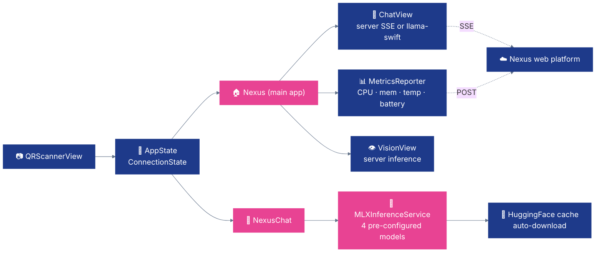

# 📱 Nexus — iOS & macOS

**Nexus for Apple — Swift 6 · MLX on-device inference · two app targets (`Nexus` + `NexusChat`).**

[](https://swift.org/)
[](https://developer.apple.com/ios/)
[](https://developer.apple.com/xcode/)
[](https://github.com/ml-explore/mlx-swift-lm)

---

## ✨ What it does

- 🧠 **On-device LLM + VLM inference** — MLX runs 4-bit quantized models natively on Apple Silicon (iPhone / iPad / M-series Mac)
- 💬 **Two apps in one repo** — `Nexus` (full device client: monitor, vision, chat, settings) and `NexusChat` (standalone MLX chat with image support)
- 📸 **Multimodal** — attach photos to chat for vision-language models (Qwen 2.5 VL)
- 🤔 **Thinking blocks** — parses `<think>…</think>` output and renders collapsible reasoning UI
- 📊 **Device monitoring** — CPU / memory / temperature / battery pushed to the server every 15 s
- 📷 **QR pairing** — register against the Nexus server in one scan

---

## 🚀 Quick Start

This repo uses **[XcodeGen](https://github.com/yonaskolb/XcodeGen)** — the `.xcodeproj` is generated from `project.yml`, not committed.

```bash
brew install xcodegen
xcodegen generate          # creates Nexus.xcodeproj
open Nexus.xcodeproj       # then Cmd+R on a physical Apple Silicon device
```

**Requires:** Xcode 16+, iOS 18+, macOS 15+ (for macOS target), Swift 6. MLX does **not** run on the Simulator — you need a real arm64 Apple device.

On first launch, scan the QR from the Nexus web UI (`/devices`) or enter the server URL manually.

---

## 🎯 Targets

| Target | Platform | On-device engine | Purpose |
|---|---|---|---|
| **`Nexus`** | iOS | [llama-swift](https://github.com/mattt/llama.swift) v2.8281.0 | Full device client — Connect · Models · Chat · Vision · Metrics · Settings |
| **`NexusChat`** | iOS | [mlx-swift-lm](https://github.com/ml-explore/mlx-swift-lm) (MLXLLM + MLXVLM + MLXLMCommon) | Standalone chat with 4 pre-configured MLX models |

Both targets share utility code via file paths in `project.yml`.

---

## 🏗️ Architecture



---

## 🧠 Pre-configured MLX models (NexusChat)

From `NexusChat/ModelConfiguration.swift` — auto-downloaded from HuggingFace on first run, cached on-device.

| Model | Size | Vision | HF repo |
|---|---|---|---|
| **Qwen3.5 0.8B** | ~0.5 GB | ✅ | `mlx-community/Qwen3.5-0.8B-4bit` |
| **Qwen3 1.7B** | ~1.0 GB | ❌ | `mlx-community/Qwen3-1.7B-4bit` |
| **LFM 1.2B Thinking** | ~0.7 GB | ❌ | `LiquidAI/LFM2.5-1.2B-Thinking-MLX-4bit` |
| **Gemma 3 1B** | ~0.6 GB | ❌ | `mlx-community/gemma-3-1b-it-4bit` |

GPU cache is capped at 512 MB to keep the system responsive on 6-8 GB devices.

---

## 📁 Code map

| Area | Path | Notes |
|---|---|---|
| **App configuration** | `project.yml` | XcodeGen spec — targets, deps, settings |
| **Swift package** | `Package.swift` | Defines `NexusChat` library + `mlx-swift-lm` dep |
| **Nexus app entry** | `NexusApp/NexusApp.swift` | `@main` struct, wraps `ContentView` with `AppState` |
| **NexusChat app entry** | `NexusChat/NexusChatApp.swift` | `@main` struct for standalone chat |
| **MLX inference** | `NexusChat/MLXInferenceService.swift` | Model load, token streaming, GPU cache mgmt |
| **Model config** | `NexusChat/ModelConfiguration.swift` | 4 pre-configured MLX models |
| **App state** | `NexusApp/AppState.swift` | `ConnectionState` enum, device ID, server URL |
| **Metrics** | `NexusApp/MetricsReporter.swift` | 15 s periodic push of device stats |
| **API client** | `NexusApp/NexusAPIService.swift` | REST + SSE to Nexus server |
| **QR scan** | `NexusApp/QRScannerView.swift` | Device pairing from server QR code |
| **Vision** | `NexusApp/VisionView.swift` | `PhotosPicker` → server vision inference |
| **Chat + thinking** | `NexusApp/ChatView.swift`, `ChatMessage.swift` | Parses `<think>…</think>` into collapsible UI |

---

## 🔧 Dependencies

Defined in `project.yml`:

| Package | Where | Role |
|---|---|---|
| [mlx-swift-lm](https://github.com/ml-explore/mlx-swift-lm) | NexusChat | MLX LLM + VLM runtime |
| [llama-swift](https://github.com/mattt/llama.swift) | Nexus | Alternate inference path |

No CocoaPods or Carthage — Swift Package Manager only.

---

## 🌐 Server API

`Nexus` main app calls:

| Endpoint | Purpose |
|---|---|
| `POST /api/auth/login` | Login → JWT |
| `POST /api/mobile/register` | Register this device |
| `POST /api/chat` (SSE) | Server-side chat, token stream |
| `POST /api/mobile/vision/infer` | Server-side YOLO / VLM |
| `POST /api/telemetry/report` | Push CPU / memory / temp / battery |

---

## 🧪 Troubleshooting

- **`xcodegen: command not found`** — `brew install xcodegen` (or install from [yonaskolb/XcodeGen](https://github.com/yonaskolb/XcodeGen)).
- **MLX fails to load model** — the Simulator is not supported; run on a physical iPhone / iPad / M-series Mac. First-run download can be a few hundred MB; wait for it to finish.
- **Xcode code signing error** — set `DEVELOPMENT_TEAM` in Xcode → Signing & Capabilities, or edit `project.yml` and re-run `xcodegen generate`.
- **Memory warnings with Qwen3 1.7B on a 6 GB phone** — fall back to a smaller model (`Gemma 3 1B` fits comfortably on 6 GB).

---

Part of [QpiAI Nexus](../README.md). Licensed under [Apache 2.0](../LICENSE).
