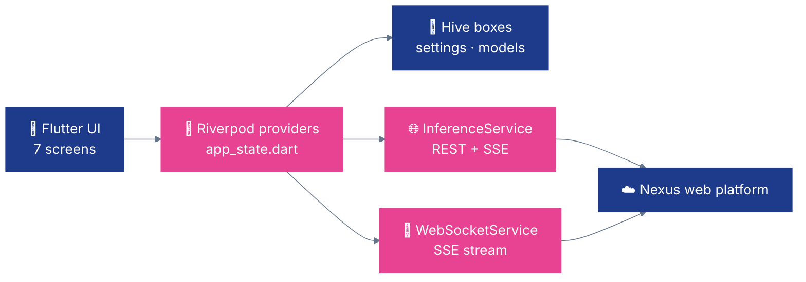

# 🎯 Nexus — Flutter Mobile

**Nexus for Flutter — cross-platform REST client for Android + iOS. Riverpod · Hive · fl_chart.**

[](https://flutter.dev/)
[](https://dart.dev/)
[](https://developer.android.com/)
[](https://developer.apple.com/ios/)

---

## ✨ What it does

- 📱 **One codebase, two platforms** — Android (minSdk 21) and iOS from a single Flutter app
- 💬 **Chat with server-hosted models** — any LLM deployed on the Nexus platform; SSE token streaming; image attachment for VLMs
- 👁️ **Vision inference** — pick an image, run it against a server-hosted YOLO model, overlay bounding boxes
- 📊 **Live metrics** — rolling 60-sample CPU / memory / temperature / battery graphs
- 📷 **QR pairing** — scan the QR from the Nexus web UI and auto-register
- 💾 **Offline-friendly settings** — Hive persists server URL, auth token, and deployed-model list across launches

This client does **no on-device inference**; it's a pure REST + SSE front-end for the Nexus web platform.

---

## 🚀 Quick Start

```bash
flutter pub get
flutter pub run build_runner build    # generates Riverpod + Hive code
flutter run                           # debug on connected device
```

**Build release artifacts:**

```bash
flutter build apk --release           # Android APK
flutter build appbundle               # Android App Bundle (Play Store)
flutter build ios --release           # iOS (requires Xcode)
```

**Requires:** Flutter SDK 3.16+, Dart 3.2+. For iOS builds you also need macOS + Xcode.

On first launch, point at your Nexus server (default `http://localhost:7777`) and log in — default credentials are `admin` / `qpiai-nexus`.

---

## 🏗️ Architecture



State changes flow through Riverpod providers; persistent state (server URL, auth token, deployed-model list) is mirrored into Hive boxes so the app survives cold starts without round-tripping to the server.

---

## 📱 Screens (7)

| Screen | File | Purpose |
|---|---|---|
| **Home** | `lib/screens/home_screen.dart` | Server URL input, hardware detection, device registration |
| **Models** | `lib/screens/models_screen.dart` | Browse deployed models, filter by quantization method |
| **Chat** | `lib/screens/chat_screen.dart` | Model selector, image attach, streamed token output |
| **Vision** | `lib/screens/vision_screen.dart` | Image picker → server inference → bbox overlay + inference time |
| **Metrics** | `lib/screens/metrics_screen.dart` | Live fl_chart graph (CPU/mem/temp/battery, 60-sample window) |
| **Settings** | `lib/screens/settings_screen.dart` | Server URL, connection status, auth token |
| **QR Scanner** | `lib/screens/qr_scanner_screen.dart` | `mobile_scanner` for device pairing |

---

## 🔧 Stack

| Package | Version | Role |
|---|---|---|
| [flutter_riverpod](https://pub.dev/packages/flutter_riverpod) | ^2.4.9 | State management |
| [riverpod_annotation](https://pub.dev/packages/riverpod_annotation) | ^2.3.3 | Codegen for providers |
| [hive](https://pub.dev/packages/hive) + [hive_flutter](https://pub.dev/packages/hive_flutter) | 2.2.3 / 1.1.0 | Local persistence |
| [fl_chart](https://pub.dev/packages/fl_chart) | ^0.66.0 | Metrics graphs |
| [http](https://pub.dev/packages/http) | ^1.2.0 | REST client |
| [image_picker](https://pub.dev/packages/image_picker) | ^1.0.7 | Camera / gallery |
| [mobile_scanner](https://pub.dev/packages/mobile_scanner) | ^5.1.1 | QR scanning |
| [device_info_plus](https://pub.dev/packages/device_info_plus) · [battery_plus](https://pub.dev/packages/battery_plus) · [sensors_plus](https://pub.dev/packages/sensors_plus) | 9.x / 5.x / 3.x | Device telemetry |

---

## 🌐 Server API

| Endpoint | Purpose |
|---|---|
| `POST /api/auth/login` | Email/password → JWT |
| `POST /api/mobile/register` | Register this device |
| `GET  /api/mobile/models` | List deployed models |
| `GET  /api/chat/models` | List inference models |
| `POST /api/chat` (SSE) | Chat inference with optional image |
| `GET  /api/mobile/vision/models` | Vision model catalog |
| `POST /api/mobile/vision/infer` | YOLO detection |
| `POST /api/telemetry/report` | Push device metrics |
| `GET  /api/mobile/ws` (SSE) | Real-time connection events |

---

## 🔄 State management

Providers live in `lib/core/app_state.dart`:

- `serverUrlProvider` — `StateProvider<String>`, mirrored to Hive box `settings`
- `isAuthenticatedProvider` — `StateProvider<bool>`
- `deviceIdProvider` — `StateProvider<String?>`
- `connectionStatusProvider` — `StreamProvider<ConnectionStatus>` watching `WebSocketService.statusStream`
- `deployedModelsProvider` — `StateNotifierProvider`, with `_loadFromStorage()` / `_saveToStorage()` against Hive box `models`
- `inferenceServiceProvider` — `Provider<InferenceService>` singleton

---

## 📁 Code map

| Area | Path | Notes |
|---|---|---|
| **App shell** | `lib/main.dart` | `runApp` + `BottomNavigationBar` wrapping the 7 screens |
| **Screens** | `lib/screens/*_screen.dart` | One file per screen |
| **Providers & state** | `lib/core/app_state.dart` | Riverpod providers + Hive box wiring |
| **Services** | `lib/services/inference_service.dart`, `websocket_service.dart` | REST + SSE clients |
| **Models** | `lib/models/` | JSON model / message / metric types |

---

## 🧪 Troubleshooting

- **`flutter: command not found`** — install Flutter from [flutter.dev](https://flutter.dev/docs/get-started/install) and put `flutter/bin` on `PATH`.
- **Codegen errors after adding a provider** — re-run `flutter pub run build_runner build --delete-conflicting-outputs`.
- **iOS build fails on first run** — `cd ios && pod install`, then retry.
- **SSE disconnects on mobile data** — the default `http` package keeps connections alive; if your carrier kills idle sockets, the `WebSocketService` auto-reconnects on `statusStream` changes.

---

Part of [QpiAI Nexus](../README.md). Licensed under [Apache 2.0](../LICENSE).
